# mini-react

React의 핵심 동작 원리를 바닥부터 직접 구현한 학습용 프로젝트입니다.  
Virtual DOM, Diff/Patch, Hooks(useState · useEffect · useMemo), FunctionComponent를 Vanilla JS로 구현합니다.

---

## 목차

1. [프로젝트 개요](#프로젝트-개요)
2. [전체 아키텍처](#전체-아키텍처)
3. [디렉토리 구조](#디렉토리-구조)
4. [핵심 구현](#핵심-구현)
   - [Virtual DOM](#virtual-dom)
   - [Diff 알고리즘](#diff-알고리즘)
   - [Commit (Patch 적용)](#commit-patch-적용)
   - [FunctionComponent](#functioncomponent)
   - [Hooks](#hooks)
5. [예제 애플리케이션](#예제-애플리케이션)
   - [Basic Counter](#basic-counter)
   - [Hooks Demo](#hooks-demo)
   - [Departure Board](#departure-board)
   - [Virtual DOM Lab](#virtual-dom-lab)
6. [테스트](#테스트)
7. [실행 방법](#실행-방법)

---

## 프로젝트 개요

| 항목 | 내용 |
|---|---|
| 언어 | Vanilla JavaScript (ES Modules) |
| 외부 의존성 | 없음 |
| 테스트 | Node.js 내장 `node:test` |
| 빌드 | 불필요 |

### 구현 목표 (requirements.md 기반)

```
✅ 함수형 컴포넌트 (FunctionComponent 클래스)
✅ useState  — 상태 관리 및 자동 리렌더링
✅ useEffect — 사이드 이펙트 및 클린업
✅ useMemo   — 파생값 메모이제이션
✅ Virtual DOM 생성 → Diff → Patch 파이프라인
✅ 상태 끌어올리기 패턴 (Lifting State Up)
✅ 단위 테스트 + 통합 테스트
```

---

## 전체 아키텍처


---

## 디렉토리 구조

```
mini_react/
├── src/                        # 핵심 라이브러리
│   ├── index.js                # 공개 API 재내보내기
│   ├── constants.js            # VNODE_TYPES, PATCH_TYPES 상수
│   ├── h.js                    # VNode 팩토리 (createElement)
│   ├── render.js               # 렌더 오케스트레이터
│   ├── diff.js                 # Virtual DOM 비교 알고리즘
│   ├── commit.js               # Patch → 실제 DOM 반영
│   ├── create-real-node.js     # VNode → DOM 노드 생성
│   ├── dom-props.js            # 속성/이벤트 핸들러 관리
│   ├── path.js                 # DOM 경로 유틸리티
│   ├── function-component.js   # FunctionComponent 클래스
│   ├── hooks.js                # useState, useEffect, useMemo
│   ├── debug.js                # 디버그 이벤트 버스
│   └── dom-to-vnode.js         # 실제 DOM → VNode 변환
│
├── examples/
│   ├── basic-counter/          # render/diff/commit 기초 데모
│   ├── hooks-demo/             # 훅 3종 동작 확인 데모
│   ├── departure-board/        # 출발 안내판 (메인 예제)
│   └── virtual-dom-lab/        # Virtual DOM 학습 인터랙티브 실습
│
├── test/
│   ├── h.test.js
│   ├── diff.test.js
│   ├── render.test.js
│   ├── function-component.test.js
│   ├── hooks.test.js
│   └── hooks-demo.test.js
│
├── package.json
└── requirements.md
```

---

## 핵심 구현

### Virtual DOM

Virtual DOM은 실제 DOM을 모방하는 **순수 JS 객체 트리**입니다.  
`h()` 함수로 VNode를 생성하고, 세 가지 노드 타입을 구분합니다.

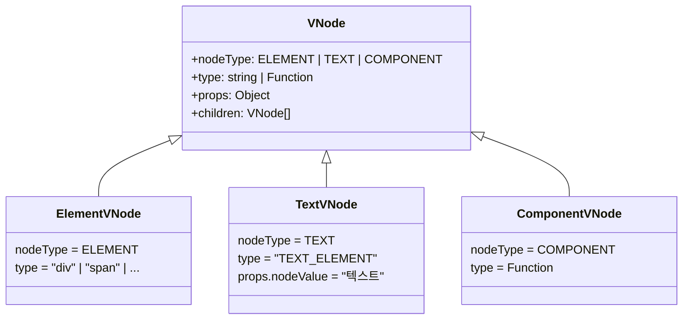

**VNode 생성 예시:**

```js
// <div class="board"><h1>출발 안내</h1></div>
h('div', { className: 'board' },
  h('h1', null, '출발 안내')
)

// 결과 VNode 트리
{
  nodeType: ELEMENT,
  type: 'div',
  props: { className: 'board' },
  children: [
    {
      nodeType: ELEMENT,
      type: 'h1',
      props: {},
      children: [
        { nodeType: TEXT, type: 'TEXT_ELEMENT', props: { nodeValue: '출발 안내' }, children: [] }
      ]
    }
  ]
}
```

---

### Diff 알고리즘

이전 VNode와 새 VNode를 비교해 **최소한의 변경 목록(Patch[])** 을 계산합니다.

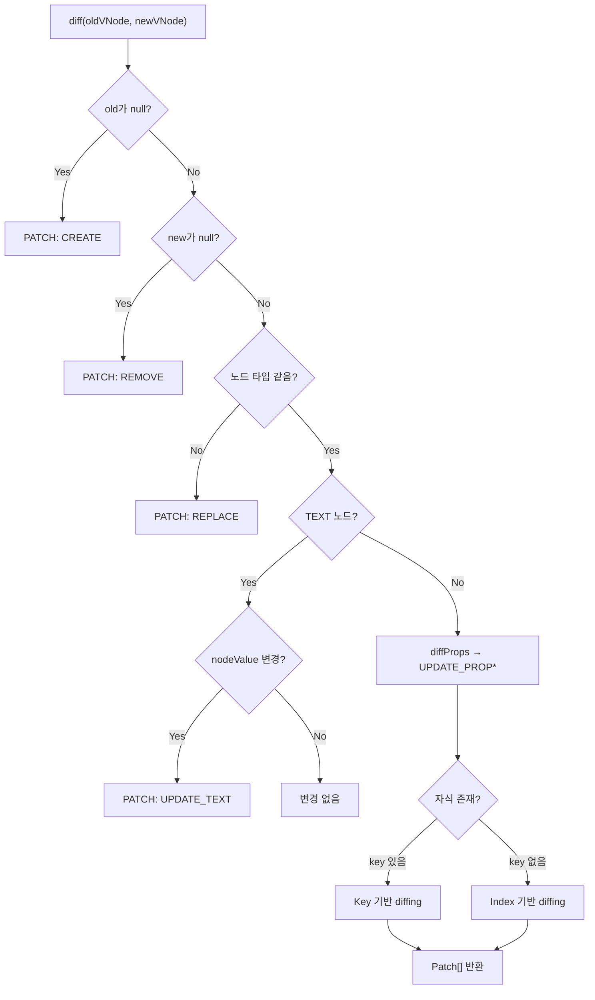

**Patch 종류:**

| Patch 타입 | 설명 |
|---|---|
| `CREATE` | 새 노드 추가 |
| `REMOVE` | 기존 노드 제거 |
| `REPLACE` | 노드 전체 교체 (타입 변경 시) |
| `UPDATE_PROP` | 속성/이벤트 변경 |
| `UPDATE_TEXT` | 텍스트 내용 변경 |

**Key 기반 vs Index 기반 Diffing:**

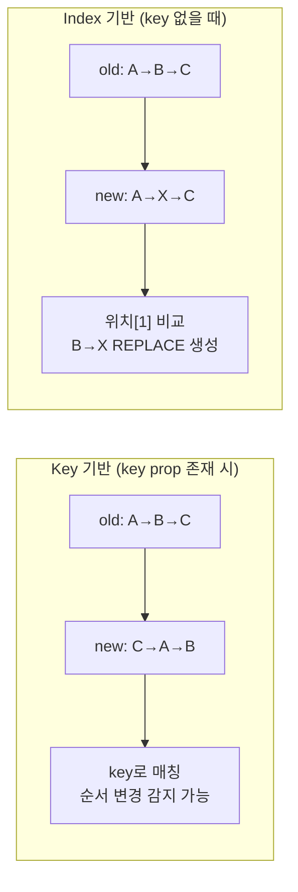

---

### Commit (Patch 적용)

Patch 배열을 순서대로 실제 DOM에 반영합니다.  
`path` 문자열(`"root.children[0].children[2]"`)로 대상 노드를 정확히 찾아 조작합니다.

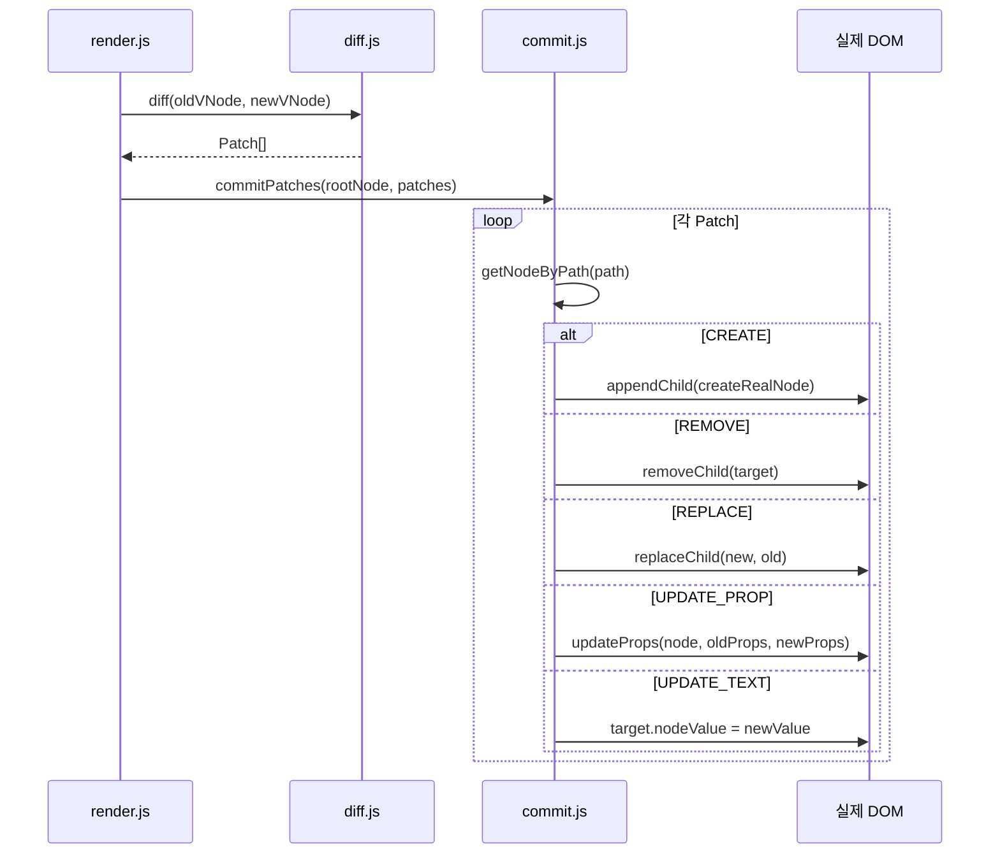

---

### FunctionComponent

상태를 가진 **루트 컴포넌트 래퍼 클래스**입니다.  
요구사항에 따라 Hook은 최상위 컴포넌트에서만 사용하고, 자식은 순수 함수로 유지합니다.

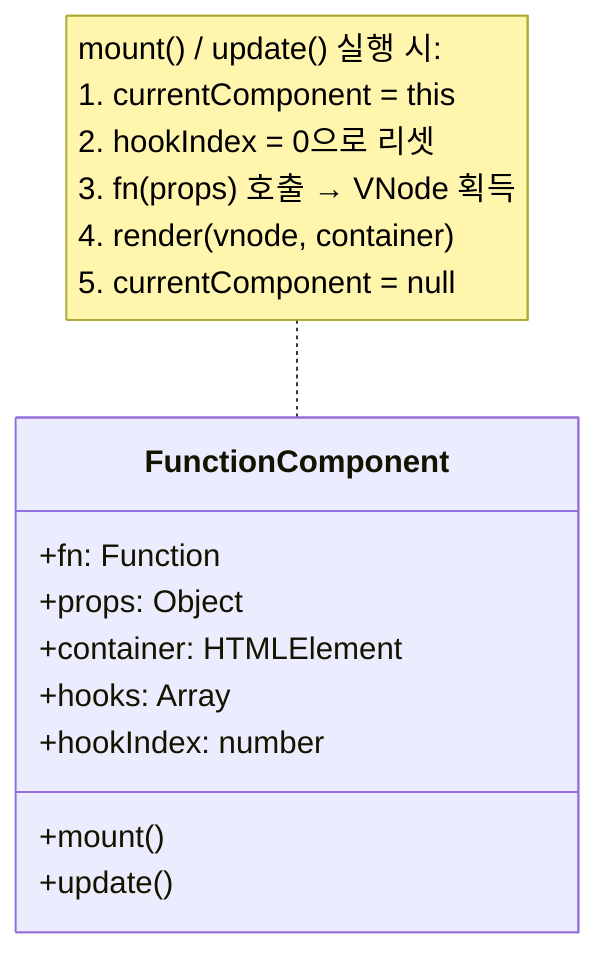

**컴포넌트 트리 설계 원칙 (Lifting State Up):**

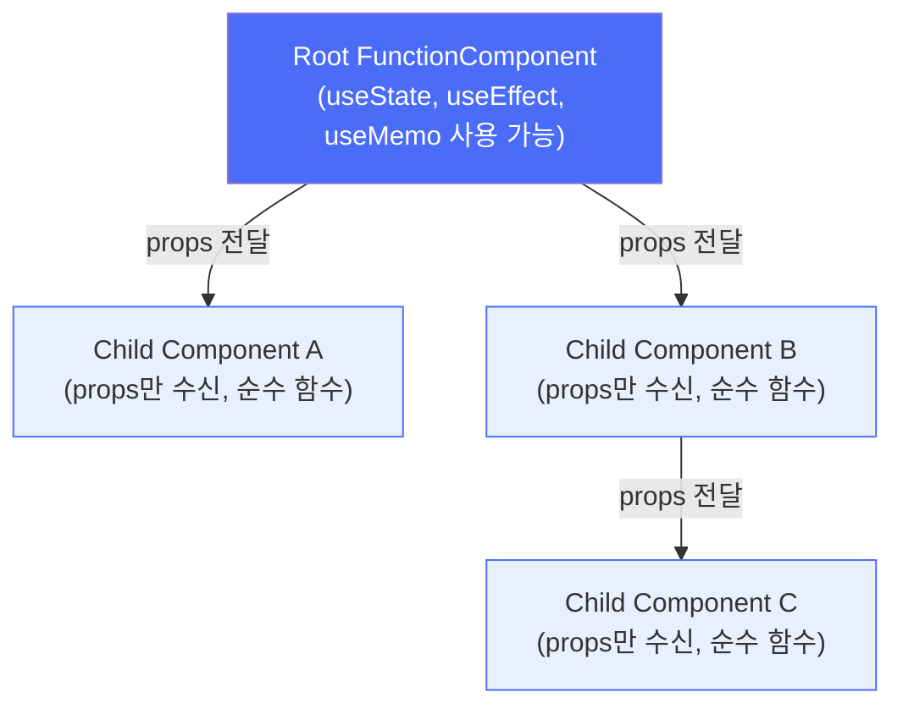

> 상태는 루트에서만 관리되며, 자식 컴포넌트는 `props`만 받아 렌더링합니다.

---

### Hooks

훅은 `FunctionComponent`의 `hooks` 배열에 **슬롯 단위**로 저장됩니다.  
`hookIndex`가 렌더링마다 0부터 순서대로 증가하므로 **훅 호출 순서가 일정해야** 합니다.

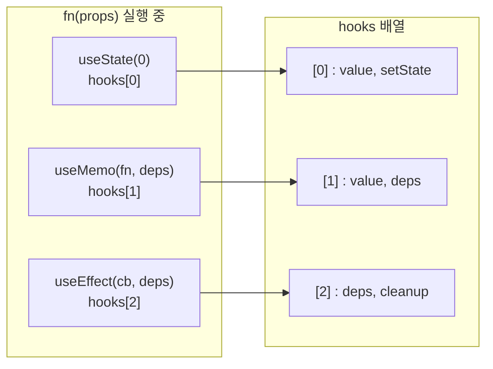

#### useState

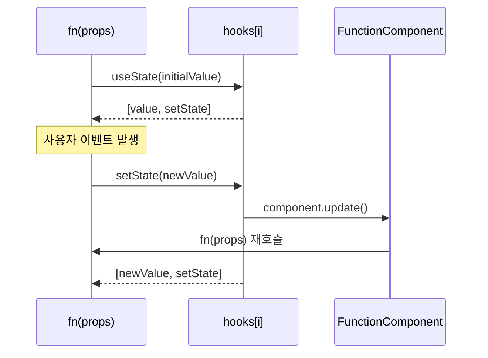

#### useEffect

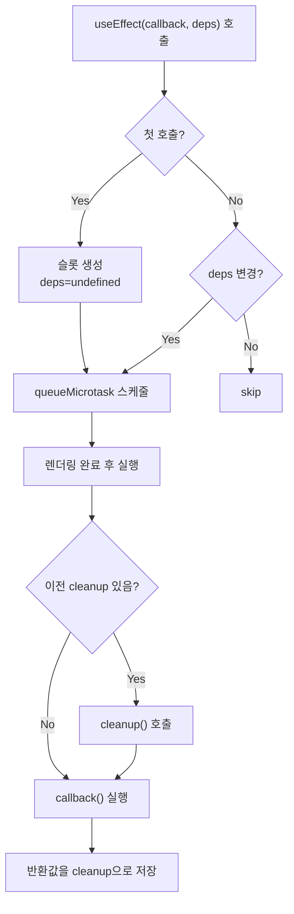

#### useMemo

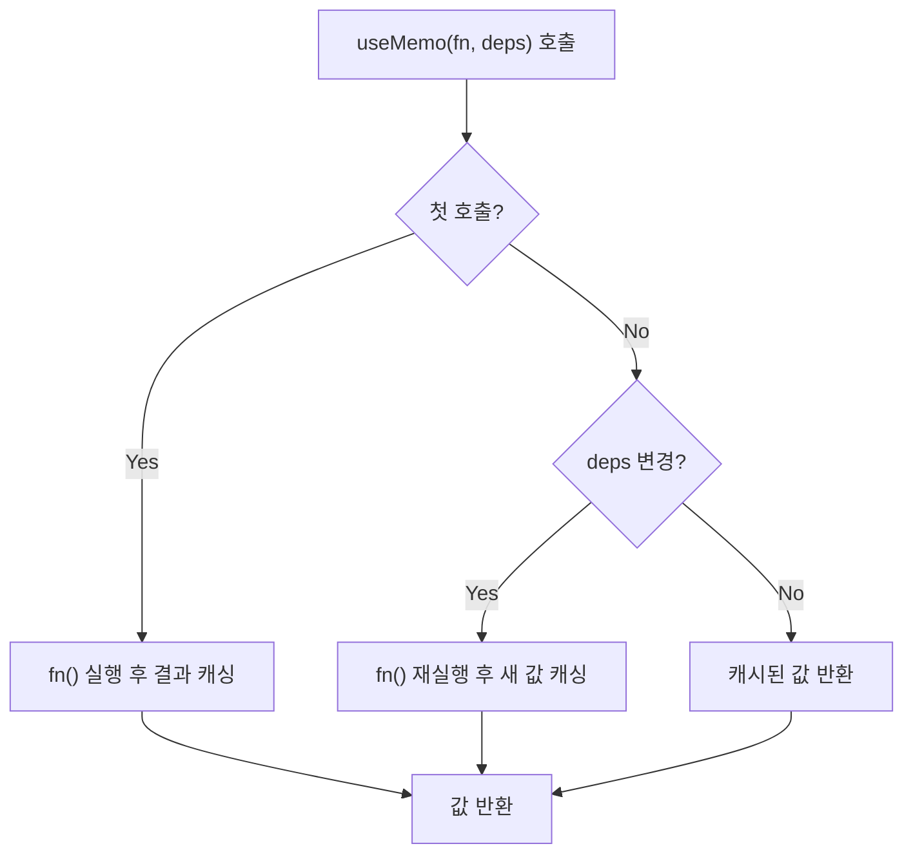

---

## 예제 애플리케이션

### Basic Counter

가장 단순한 데모. `FunctionComponent`나 훅 없이 `h()` + `render()` 직접 사용.  
버튼 클릭마다 diff 결과(패치 목록, oldVDOM, newVDOM)를 패널에 시각화합니다.

```
examples/basic-counter/index.html
```

---

### Hooks Demo

`FunctionComponent`와 훅 3종의 독립적 동작을 검증하는 데모.

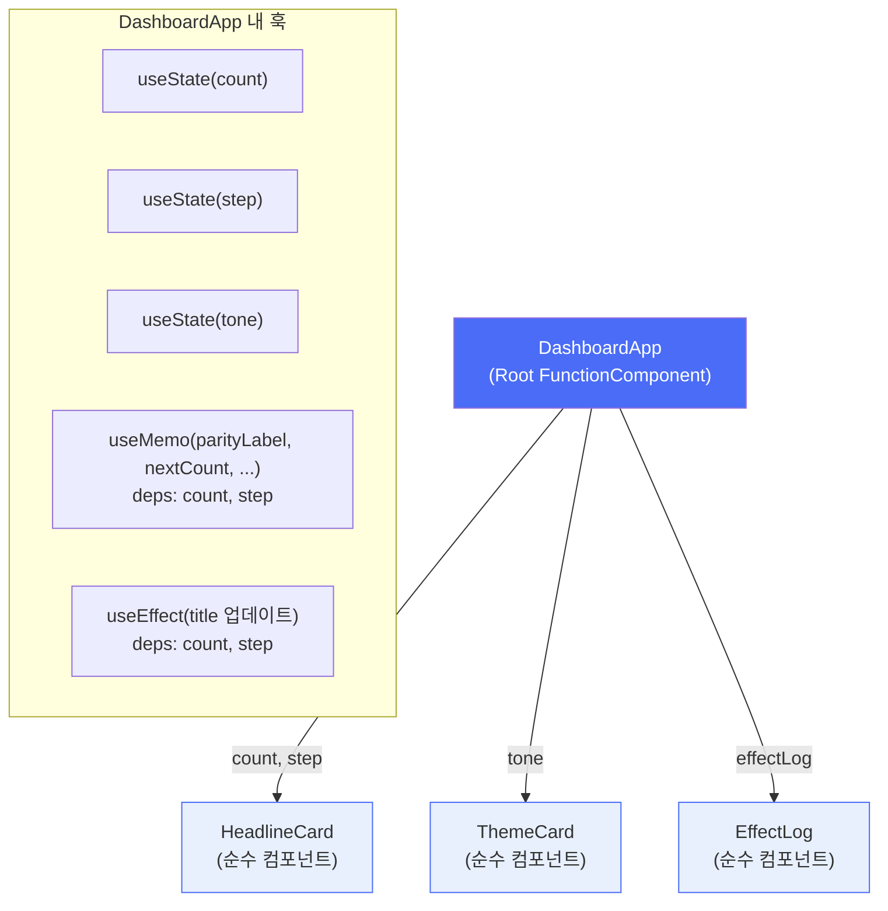

**핵심 포인트:** `tone`(테마) 변경 시 리렌더링은 일어나지만, `useMemo`와 `useEffect`의 deps에 `tone`이 없으므로 재계산/재실행되지 않습니다.

```
examples/hooks-demo/index.html
```

---

### Departure Board

메인 예제 애플리케이션. 공항/기차역 출발 안내판을 구현합니다.

```
examples/departure-board/index.html
```

#### 컴포넌트 구조

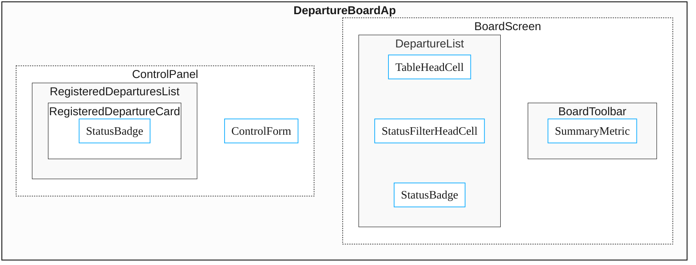

#### 상태 및 훅 설계

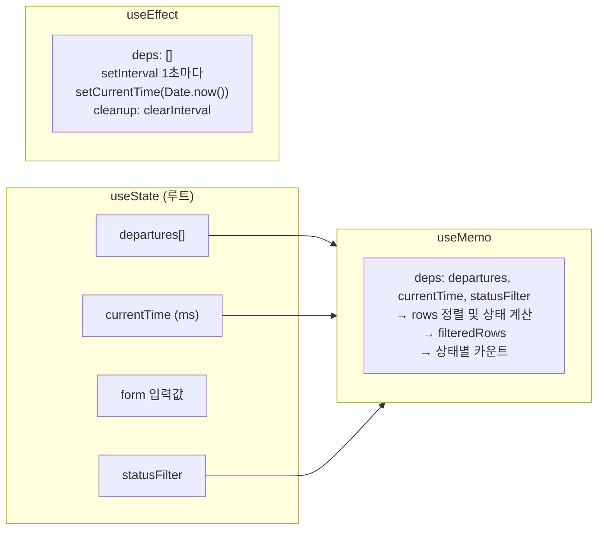

#### 항공편 상태 전환

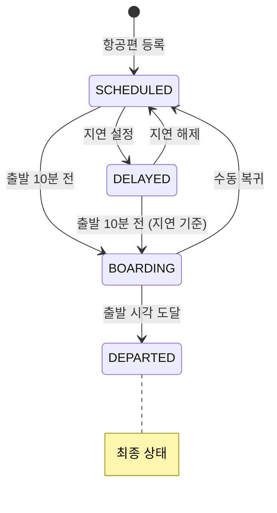

---

### Virtual DOM Lab

Virtual DOM의 동작 원리를 **인터랙티브하게 학습**하는 시각화 도구입니다.

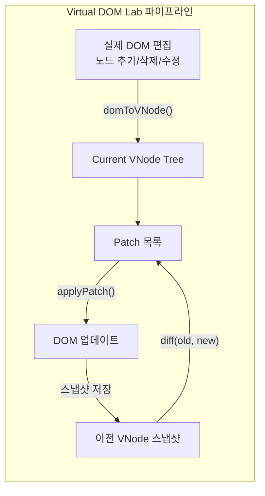

**주요 기능:**
- DOM 노드 클릭 선택 → 자식 추가 / 태그 교체 / 삭제
- Previous VNode ↔ Current VNode 트리 시각화
- diff 결과 패치 목록 실시간 표시
- MutationObserver 로그
- Undo/Redo 상태 히스토리

```
examples/virtual-dom-lab/index.html
```

---

## 테스트

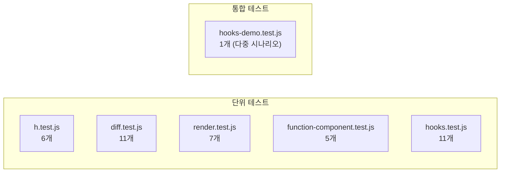

| 테스트 파일 | 검증 대상 | 주요 케이스 |
|---|---|---|
| `h.test.js` | VNode 생성 | 타입 분류, null 필터링, key 보존 |
| `diff.test.js` | Diff 알고리즘 | 5가지 Patch 생성, key 기반 재정렬, 중복 key 경고 |
| `render.test.js` | render 오케스트레이터 | 순차 렌더, null 렌더, 다중 패치 커밋 순서 |
| `function-component.test.js` | FunctionComponent | mount/update, hookIndex 리셋, currentComponent 전환 |
| `hooks.test.js` | useState/useEffect/useMemo | 초기값, 업데이트, deps 비교, cleanup, 슬롯 독립성 |
| `hooks-demo.test.js` | 통합 시나리오 | 테마 전환시 memo/effect 미실행, step 변경시 재계산 |

**테스트 실행:**

```bash
npm test
# 또는
node --test
```

> 모든 테스트는 외부 의존성 없이 Node.js 내장 `node:test`와 `node:assert/strict`만 사용합니다.  
> 브라우저 없이 실행 가능하도록 `global.document`를 직접 구성한 Fake DOM 환경을 사용합니다.

---

## 실행 방법

```bash
# 의존성 설치 불필요 (외부 패키지 없음)

# 테스트 실행
npm test

# 예제 실행 — 각 폴더의 index.html을 브라우저에서 열기
open examples/departure-board/index.html
open examples/hooks-demo/index.html
open examples/basic-counter/index.html
open examples/virtual-dom-lab/index.html
```

> ES Module을 사용하므로 `file://` 프로토콜에서 CORS 오류가 발생할 수 있습니다.  
> 로컬 서버(`npx serve .` 또는 VS Code Live Server)를 통해 열면 정상 동작합니다.

---

## 전체 업데이트 흐름 요약

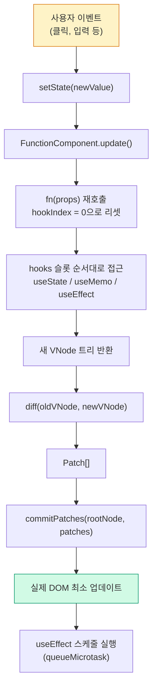
