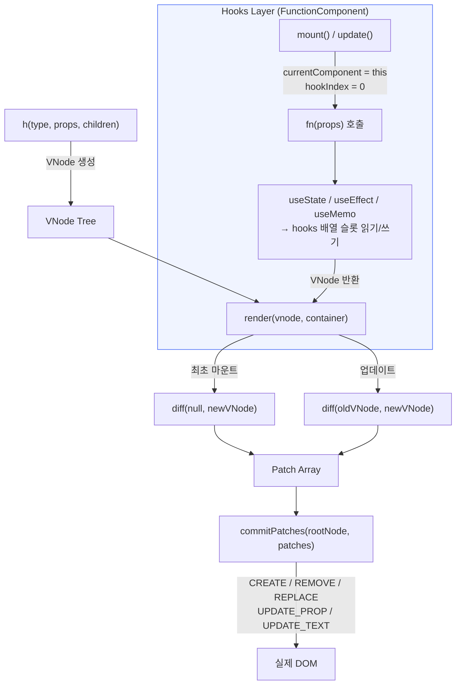
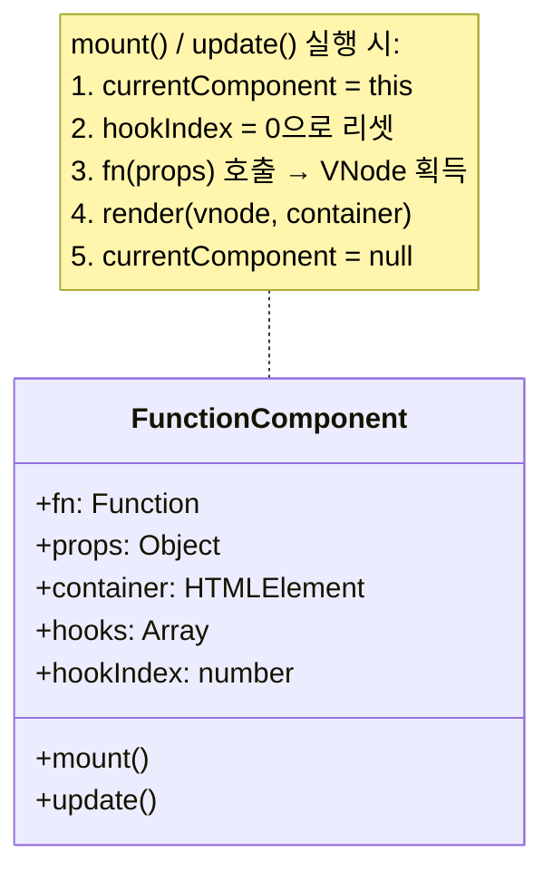
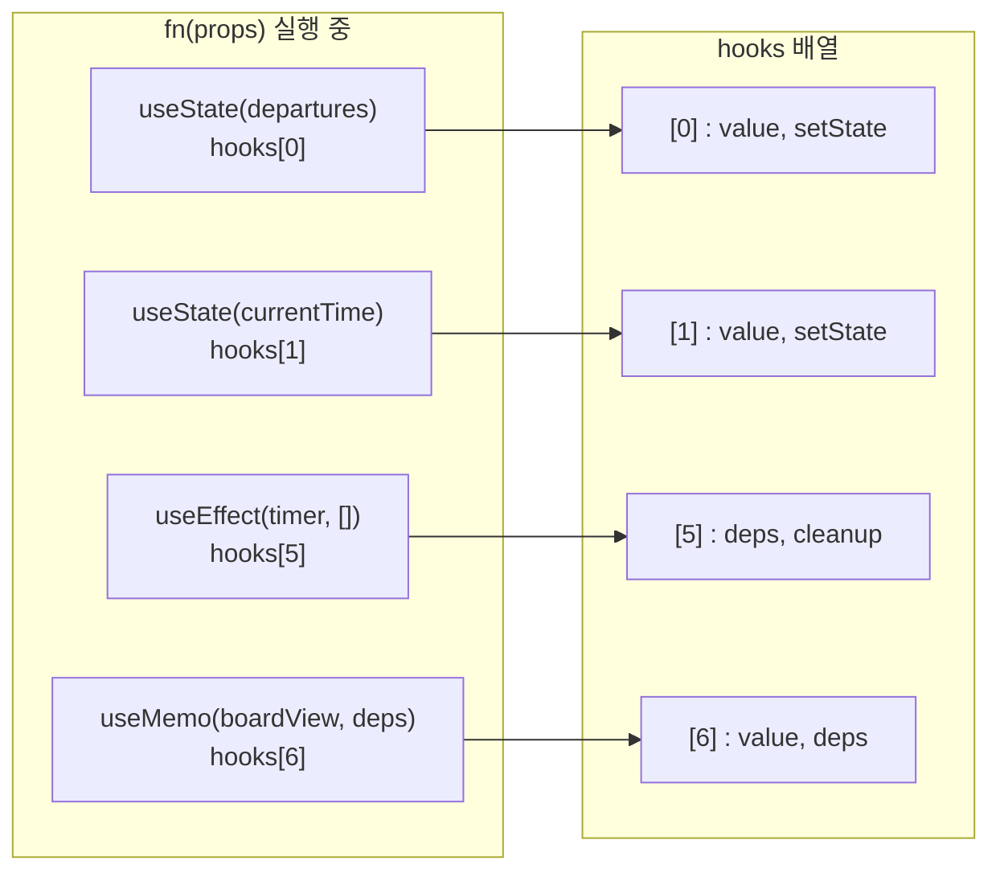
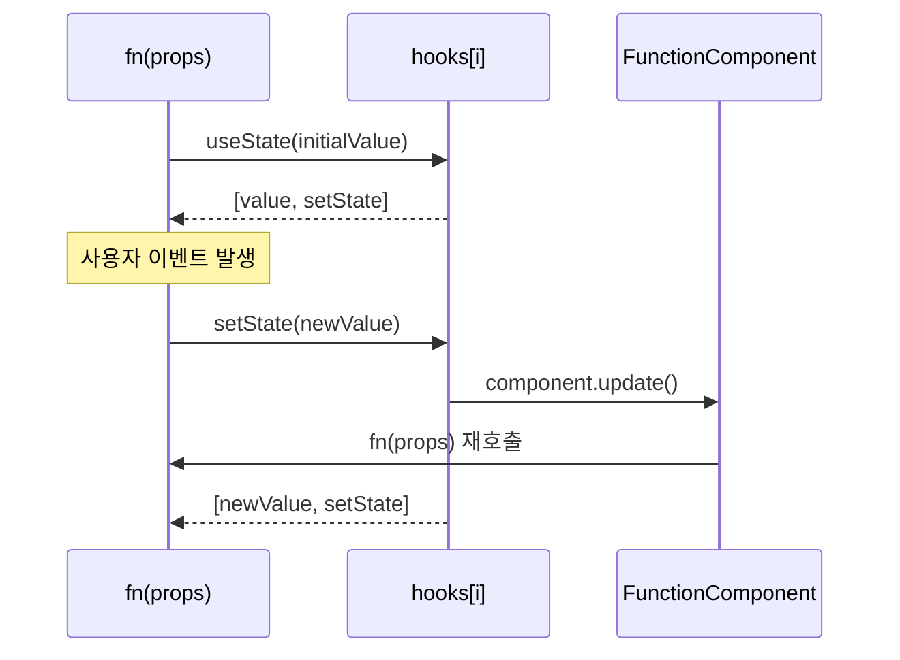
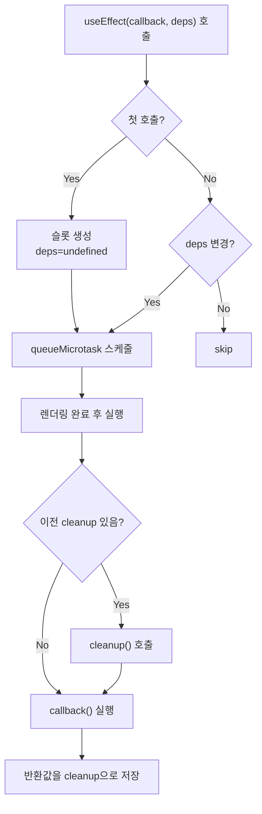
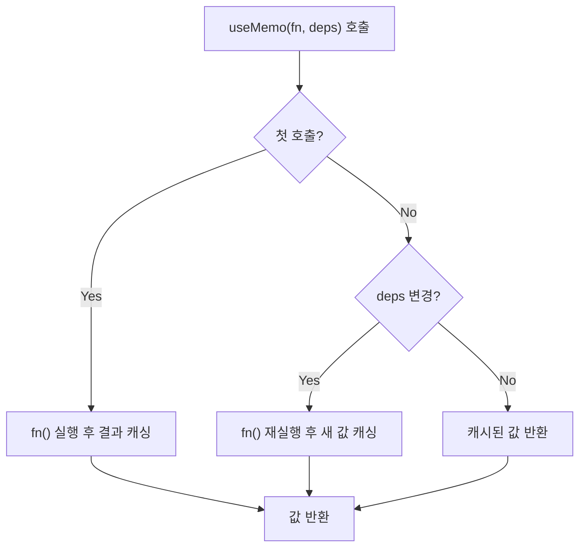
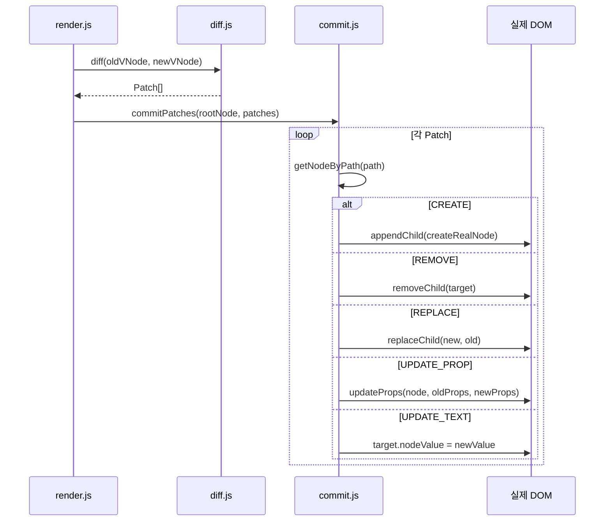
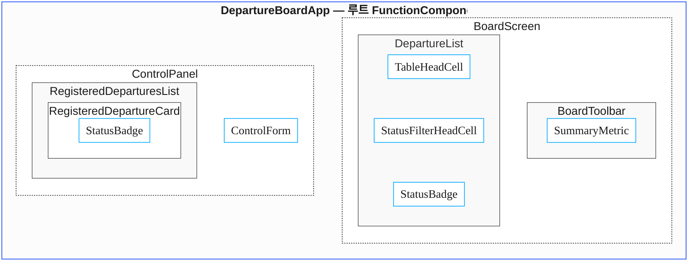
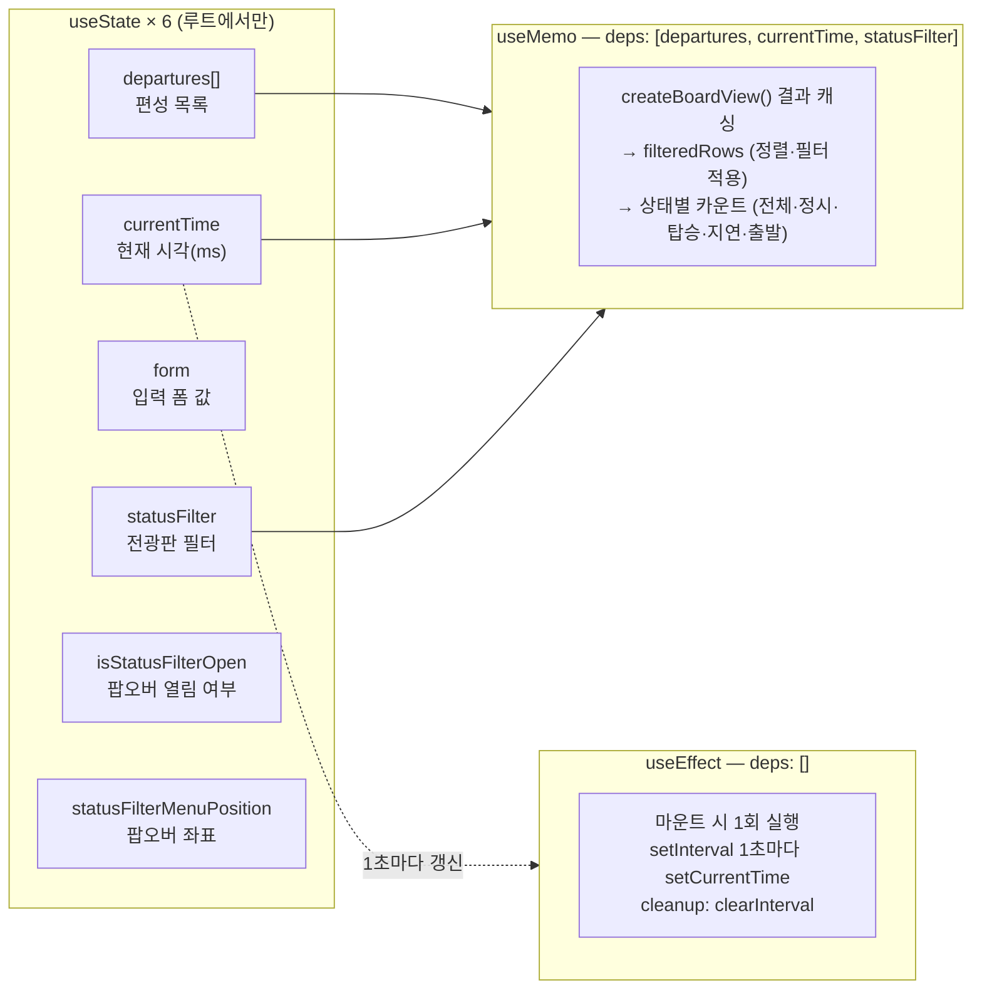
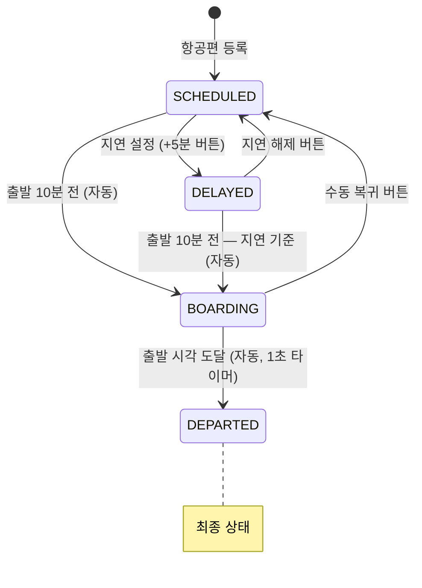

# mini-react — 출발 전광판

React의 핵심 동작 원리를 바닥부터 직접 구현한 학습용 프로젝트입니다.  
Virtual DOM, Diff/Patch, Hooks(useState · useEffect · useMemo), FunctionComponent를 Vanilla JS로 구현하고,  
이를 활용해 **공항·기차역 출발 안내판** 웹 앱을 완성했습니다.

```
open examples/departure-board/index.html   # 로컬 서버 필요 (ES Module)
npx serve .                                # 또는 VS Code Live Server
```

---

## 목차

1. [요구사항 구현 요약](#요구사항-구현-요약)
2. [전체 아키텍처](#전체-아키텍처)
3. [핵심 구현](#핵심-구현)
   - [FunctionComponent](#functioncomponent)
   - [Hooks](#hooks)
   - [Virtual DOM → Diff → Patch](#virtual-dom--diff--patch)
4. [출발 전광판 예제](#출발-전광판-예제)
   - [컴포넌트 구조 (Lifting State Up)](#컴포넌트-구조-lifting-state-up)
   - [상태 및 훅 설계](#상태-및-훅-설계)
   - [항공편 상태 전환](#항공편-상태-전환)
5. [테스트](#테스트)
6. [디렉토리 구조](#디렉토리-구조)

---

## 요구사항 구현 요약

| 요구사항 | 구현 위치 | 내용 |
|---|---|---|
| 함수형 컴포넌트 (FunctionComponent 클래스) | `src/function-component.js` | hooks 배열, mount(), update() 포함 |
| useState | `src/hooks.js` | 슬롯 기반 상태 저장, setState → update() 트리거 |
| useEffect | `src/hooks.js` | deps 비교, queueMicrotask 스케줄, cleanup |
| useMemo | `src/hooks.js` | deps 변경 시만 재계산, 캐시 반환 |
| Virtual DOM + Diff + Patch | `src/diff.js`, `src/commit.js` | 변경된 부분만 실제 DOM에 반영 |
| 상태 끌어올리기 (Lifting State Up) | `examples/departure-board/main.js` | 루트만 상태 보유, 자식은 순수 함수 |
| 사용자 입력/클릭으로 화면 변경 | `examples/departure-board/main.js` | 편성 추가·삭제·지연, 필터, 1초 타이머 |
| Vanilla JS / 외부 프레임워크 금지 | 전체 | 외부 의존성 없음 |
| 단위 테스트 + 엣지 케이스 | `test/` | 6개 파일, 40+ 케이스 |

---

## 전체 아키텍처



---

## 핵심 구현

### FunctionComponent

상태를 가진 **루트 컴포넌트 래퍼 클래스**입니다.  
Hook은 최상위 컴포넌트에서만 사용하고, 자식은 순수 함수로 유지합니다.



---

### Hooks

훅은 `FunctionComponent`의 `hooks` 배열에 **슬롯 단위**로 저장됩니다.  
렌더링마다 `hookIndex`가 0부터 순서대로 증가하므로 **훅 호출 순서가 일정해야** 합니다.



#### useState



#### useEffect



#### useMemo



---

### Virtual DOM → Diff → Patch

이전 VNode와 새 VNode를 비교해 **최소한의 변경 목록(Patch[])** 을 계산하고,  
`path` 문자열로 대상 노드를 정확히 찾아 실제 DOM에만 반영합니다.



**Patch 종류:**

| Patch 타입 | 설명 |
|---|---|
| `CREATE` | 새 노드 추가 |
| `REMOVE` | 기존 노드 제거 |
| `REPLACE` | 노드 전체 교체 (타입 변경 시) |
| `UPDATE_PROP` | 속성/이벤트 변경 |
| `UPDATE_TEXT` | 텍스트 내용 변경 |

---

## 출발 전광판 예제

공항·기차역 출발 안내판을 구현한 메인 예제입니다.  
사용자가 편성을 추가·삭제·지연 설정하면 전광판이 즉시 업데이트되고,  
1초 타이머가 현재 시각을 갱신하면서 상태(SCHEDULED → BOARDING → DEPARTED)가 자동 전환됩니다.

### 컴포넌트 구조 (Lifting State Up)

**모든 상태는 루트(`DepartureBoardApp`)에서만 관리합니다.**  
자식 컴포넌트는 `props`만 받는 순수 함수로 구현해 요구사항의 제약조건을 그대로 따릅니다.



> 파란 테두리: 순수 함수 자식 컴포넌트 (state 없음, props만 수신)

---

### 상태 및 훅 설계



**핵심 포인트:**
- `useEffect`는 `deps: []`이므로 마운트 시 딱 한 번 타이머를 등록하고, 언마운트 시 `clearInterval`로 정리합니다.
- `useMemo`는 `departures`, `currentTime`, `statusFilter` 중 하나라도 바뀔 때만 전광판 계산을 다시 수행합니다. 팝오버 좌표(`statusFilterMenuPosition`) 변경처럼 board view와 무관한 상태 업데이트는 메모 재계산을 유발하지 않습니다.

---

### 항공편 상태 전환



상태 계산은 `useMemo` 안의 `getDepartureStatus(departure, currentTime)` 함수가 담당합니다.  
`currentTime`이 1초마다 갱신되면 `useMemo`가 재실행되어 전광판 전체가 최소 DOM 패치로 업데이트됩니다.

---

## 테스트

```bash
npm test
# 또는
node --test
```

| 테스트 파일 | 검증 대상 | 주요 케이스 |
|---|---|---|
| `h.test.js` | VNode 생성 | 타입 분류, null 필터링, key 보존 |
| `diff.test.js` | Diff 알고리즘 | 5가지 Patch 생성, key 기반 재정렬, 중복 key 경고 |
| `render.test.js` | render 오케스트레이터 | 순차 렌더, null 렌더, 다중 패치 커밋 순서 |
| `function-component.test.js` | FunctionComponent | mount/update, hookIndex 리셋, currentComponent 전환 |
| `hooks.test.js` | useState/useEffect/useMemo | 초기값, 업데이트, deps 비교, cleanup, 슬롯 독립성 |
| `hooks-demo.test.js` | 통합 시나리오 | 테마 전환 시 memo/effect 미실행, step 변경 시 재계산 |

> 모든 테스트는 외부 의존성 없이 Node.js 내장 `node:test`와 `node:assert/strict`만 사용합니다.  
> 브라우저 없이 실행 가능하도록 `global.document`를 직접 구성한 Fake DOM 환경을 사용합니다.

---

## 디렉토리 구조

```
mini_react/
├── src/                        # 핵심 라이브러리
│   ├── index.js                # 공개 API 재내보내기
│   ├── constants.js            # VNODE_TYPES, PATCH_TYPES 상수
│   ├── h.js                    # VNode 팩토리 (createElement)
│   ├── render.js               # 렌더 오케스트레이터
│   ├── diff.js                 # Virtual DOM 비교 알고리즘
│   ├── commit.js               # Patch → 실제 DOM 반영
│   ├── create-real-node.js     # VNode → DOM 노드 생성
│   ├── dom-props.js            # 속성/이벤트 핸들러 관리
│   ├── path.js                 # DOM 경로 유틸리티
│   ├── function-component.js   # FunctionComponent 클래스
│   ├── hooks.js                # useState, useEffect, useMemo
│   ├── debug.js                # 디버그 이벤트 버스
│   └── dom-to-vnode.js         # 실제 DOM → VNode 변환
│
├── examples/
│   └── departure-board/        # 출발 안내판 — 메인 발표 예제
│       ├── index.html
│       └── main.js
│
├── test/
│   ├── h.test.js
│   ├── diff.test.js
│   ├── render.test.js
│   ├── function-component.test.js
│   ├── hooks.test.js
│   └── hooks-demo.test.js
│
└── package.json
```
